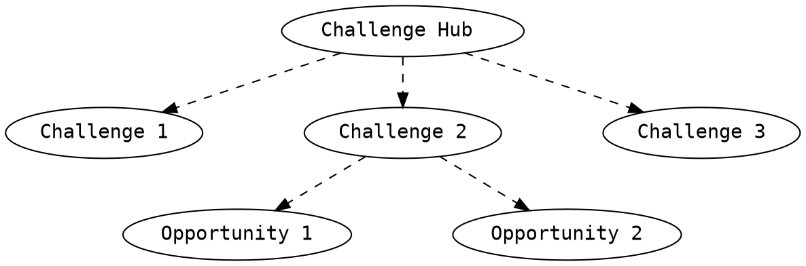

# 1. Introduction

Welcome to Alkemio, an open-source innovation platform!

This manual will help you understand the purpose of the platform, how and by whom it can be used, as well as key the functionalities and terminology.

## **What is the problem?**

**Society faces complex Challenges at all levels.** From cities and national governments working with their citizens to adapt to the opportunities offered by and implications of rapid technical and societal change, through to global topics such as the UN Sustainable Development Goals (SDGs). Companies need to re-invent themselves to remain relevant, citizens want to connect and contribute.

**Society is complex.** In our hyper connected world, any change impacts many parties. The complexity of collaborating to address Challenges, has long passed the point where any one person or organisation can solve them. We need to collaborate.

**Societal change is accelerating.** The simple fact is that we are seeing an exponential rate of change and technological development. The impact is that new Challenges are emerging faster than we can address them – and this gap is growing. Trust in existing ways of working is eroding. Too many of our citizens feel disconnected from and not able to contribute to the future we are going towards.

**Collaborating effectively on Challenges is hard.** It is changing established ways of working, affecting identities, governance structures and norms built up over centuries. And our current platforms and tooling are optimized for a simpler and more hierarchical world.

## **Why Alkemio?**

Alkemio makes it easy to host Challenges, engage communities and have contributors, from anywhere, working together on solutions. Our platform is **driven by the desired outcome**, not an activity or organization. In such a way, the needs of society remain the focus and wider engagement is possible since anyone can contribute to building a better future.

## **Who can use the Alkemio platform?**

The platform can be used in several ways by a variety of people. A distinction can be made between Users, Challenge leads, and Portfolio owners.

**User**
As an individual, you may want to drive change on topics you care about, but how? The platform allows you to _discover_ the Challenges that people work on, _choose_ those that match your interests, and _connect_ with them to contribute.

**Challenge Lead** ==Or leading organization==
If you have a particular problem, the platform can support you on your journey towards the solution. The platform can be used to create a _shared understanding_ of the Challenge, find _key stakeholders_ for your community, and connect with others who work on _similar challenges_.

**Portfolio Owner** ==Or Facilitating/Hosting Organization==
As an organization, you may be responsible for a set of Challenges. It can be difficult to keep an overview and track progress towards clear destinations. The platform enables you to control the _lifecycles_ of these Challenges, to communicate with your _community_, and see the _results_.
 
 

---

# 2. The structure of Alkemio

We can distinguish several levels on the Alkemio platform. The hierarchial order hereby is the **Alkemio platform** (a Hub of Hubs), **Challenge Hub**, **Challenge**, and **Opportunity**.

Each level has a **Community** around it. Individuals and Organizations can choose to join a Hub to contribute to multiple Challenges around a certain theme. It is also possible to join seperate Challenges in different Hubs.

Within all three levels, Users can discuss the topic, share relevant information in a structured manner, and brainstorm by using canvases.

The list below describes the key terminology within each of these levels.

:::warning
&#9888; Opportunities and Projects missing in this structure. Figure must be updated! Communities are also present in Challenges and Opportunities.
:::

 
 

---

# 3. Getting started: create an account

1. Go to https://hub.alkem.io/.
2. Click <code>Sign up</code> in right top of the screen.
3. Follow the shown instructions to confirm the registration.
4. Complete your profile registration by clicking your name at the right top of the page, by selecting <code>My profile</code> and by clicking the &#9881; button.
5. Fill in as much information as possible to make sure Alkemio can be used to its full potential!
6. You can receive email notifications by adapting the settings under <code>Notifications</code>.

:bulb: Add tags so other users can find you based on your skills, interests or location. Don't forget to include some contact details (email, socials) such that people can get in touch with you.

 
 

---

# 4. Alkemio attributes

In this Chapter, the four key attributes of Alkemio are discussed, the **Challenge hubs**, **Challenges**, **Opportunities** and **Projects**. Most of these attributes have a similar structure, containing: `Dashboard`, `Context`, `Community`, the next hierarchical attribute: `Challenge/Opportunity/Project`, `Discussions` and `Canvases`. For each of these attributes, the purpose and an example are worked out in the blue and green boxes, respectively. An overview of the Alkemio hierarchy can be found [here](https://miro.com/app/board/uXjVOJegpKs=/?invite_link_id=538937486969).

:bulb: You can use the table of contents on the left hand side to navigate trough these attributes and keep track of the structure.

## 4.1 Challenge hubs

::: info
🎯 **Purpose:** The Challenge Hub provides a thematic central workspace defined by a facilitating organization.  
:::

::: success
:memo: **Example:**
:::

These Hubs can be both **public** or **private**. The main difference is Users who want to contribute to a Public Hub require approval by the Facilitating Organization.

 
    
### 4.1.1 Dashboard

  
 Screenshot (click to expand)
  
    

    

 
    
The dashboard is the landing page of a Challenge hub and provides an overview of the Updates, Discussions, Facilitating Organization, Community and some of the Hub's Challenges.

### 4.1.2 Context

  
 Screenshot (click to expand)
  
    

    

 

The context section enables the facilitating organization to set out the Hub's:

- **Vision**
  - What does success look like? When do you know when you have achieved it?
- **Background**
  - What is the current situation? What has already been done to make progress? What results have been achieved?
- **Impact**
  - What is changed if the vision is achieved? What users or organizations will experience a different reality, for good or bad?
- **Who**
  - What organizations or users should contribute? Why would they want to engage?
- **References**
  - What references provide relevant information aside from the given details?

Lastly, all Users can add and discuss `Aspects`.

- **Aspects**
  - Aspects are `related initiatives`, `knowledge`, or `actors` marked as important by the community for reaching success.

::: warning
:point_up: **How to:**

  
 Add an aspect (click to expand)
  
    

:::

    
    
### 4.1.3 Community

  
 Screenshot (click to expand)
  
    

    

 
    
    
    
The Community is key when it comes down to solving challenges together. Anywhere on the platform, it is possible to connect and collaborate with others. The `Community` page includes three sections:      
    
* **Updates**
    * Updates on the Challenge Hub that are written by the hosting organization. Such updates can describe webinars, future meetings, developments in the Hub, etc.
* **Hosting organization**
    * The hosting organization is the initiator of the Challenge Hub.
* **Members**
    * The members are all users that are admitted to the Challenge Hub, including users affiliated to the hosting organization.
    
### 4.1.4 Challenges

> See: <a href="#Challenges">4.2 Challenges</a>

### 4.1.5 Discussions

  
 Screenshot (click to expand)
  
    

    

  
    
In the discussions section, the community can discuss the Challenge Hub. A distinction is made between four types of discussions: `general`, `ideas`,`questions` and `sharing`. 

### 4.1.6 Canvases

  
 Screenshot (click to expand)
  
    

    

  
    
 A Canvas in Alkemio is essentially a whiteboard whereby users can create and collaborate visually. Similar to well known tools such as Miro, but adapted to support the flows needed for Alkemio.

Canvases are a great way to **share best practices**, and to make available **core material** that should be used by people working on Challenges within a particular context. These are called templates in Alkemio - and Templates can be set at the Hub or Challenge level. If they are set at the Hub level then they are automatically available to all Challenges within that Hub.

::: warning
:point_up: **How to:**

  
 Create new canvas (click to expand)
  
    

  
 Browse template library (click to expand)
  
    

:::
    

## 4.2 Challenges

::: info
🎯 Purpose: A well-defined Challenge allows users to make impact on a dissatisfaction with the current reality.
:::

::: success
:memo: Example:
:::

Challenges can be defined as dissatisfactions with the current reality. Challenges must be defined within thematic Challenge Hubs. They are hence one level more specific than the Hubs. The Challenge pages follow the same structure as the Challenge Hubs. Therefore, reference is made to the explanation of the Hubs for each page section.

### 4.2.1 Dashboard

> See: <a href="#Dashboard">4.1.1 Dashboard</a>

### 4.2.2 Context

> See: <a href="#Context">4.1.2 Context</a>

### 4.2.3 Community

> See: <a href="#Community">4.1.3 Community</a>

### 4.2.4 Opportunities

An opportunity can be defined as a way of reaching the goal of the challenge. One challenge can have many opportunities. The hierarchy is thus as follows:

> See: <a href="#Opportunities">4.3 Opportunities</a>

### 4.2.5 Discussions

> See: <a href="#Discussions">4.1.5 Discussions</a>

### 4.2.6 Canvases

Canvases in the projects have the same functionality as in the Project Hub environment. The main difference is that the Canvas is more specifically applicable to the Project, than to the more general Project Hub.

> See: <a href="#Canvases">4.1.5 Canvases</a>

> [name=hoyterutteman]
> Is het een idee om steeds een voorbeeld te geven dat terugkomt. Dus de handleiding beginnen me een bepaald voorbeeld, en hier vermelden hoe een Canvas binnen de Project omgeving van toepassing kan zijn op het huidige voorbeeld.

## 4.3 Opportunities

   
    
::: info
🎯 Purpose: Opportunities can be used to define specific steps towards tackling the Challenge.
:::

::: success
:memo: Example:
:::

### 4.3.1 Dashboard

Again, the Dashboard is the landing page of an Opportunity and provides an overview of the `Context`, `Updates`, `Community`, and `Projects` around it. The page also allows you to show your interest in collaborating as demonstrated below.

::: warning
:point_up: **How to:**

  
 Show you are interested in collaborating (click to expand)

    

:::
    
> For more information, see: <a href="#Dashboard">4.1.1 Dashboard</a>    
    
### 4.3.2 Context
The Context is also similar to both the Challenge Hub and Challenge. It includes the defined Vision, Background, Impact, Who, and Aspects around an Opportunity.

Besides these sections, the `Lifecycle` functionality is especially important. It gives insights into the different phases of the Opportunity, from start to finish, to keep the Community aligned. It is key for understanding what the focus and next steps should be in that particular phase.

> For more information, see: <a href="#Context">4.1.2 Context</a>

### 4.3.3 Community

The Community includes an overview of the `Updates` and Members of an Opportunity. This will be more taylored to specifying the possible solution as well as required resources such as funding and manpower.

> For more information, see: <a href="#Community">4.1.3 Community</a>

### 4.3.4 Projects

::: info
🎯 Purpose: are
:::

::: success
:memo: Example:
:::

Projects are an important element of Opportunities. They describe solution details and how we envision the first steps. This functionality assists in managing projects and suggesting new ones to stakeholders. You can set the scope, allocate resources, pick your hero’s and let stakeholders vote for your proposal.

==who can create projects==

### 4.3.5 Canvases

Also Canvases are likely to be more focused on working out the steps towards to solution to be able to set up Projects. specific for ==canvases in challenges vs. canvases in opportunities==

> For more information, see: <a href="#Canvases">4.1.6 Canvases</a>

---

# 5. Managing Hubs and Challenges

Hubs, Challenges and Opportunities are managed by a specific facilitator. In this chapter, we will explain the different priviliges of these facilitators as well as their responsibilities.

## 5.1 The Facilitating/Hosting Organization

Each Challenge Hub has a Hosting Organization that manages the Hub as well as to some extend its Challenges and Opportunities. Their privileges are related to: - Creating, updating and deleting Challenges and Opportunties - Entity management - Assignments/removal/authorization - Communications - User management - Notifications

## 5.2 Leading Organization

Each Challenge has one or more Leading Organization(s) that manage(s) the Challenge. These Organizations

- ook een rol bij opportunity

## 5.3 Administrator

Finally, each opportunity also has an administrator.

---

# 6. Terminology

| Term                      | Explanation                                                                                                                                                                                                                                                                                     |
| ------------------------- | ----------------------------------------------------------------------------------------------------------------------------------------------------------------------------------------------------------------------------------------------------------------------------------------------- |
|                           |
| Aspects                   | Aspects can be raised by the Community. They can be used to describe important building blocks for solving the Challenge, such as a key actor, related initiative, or other knowledge.                                                                                                          |
| Background                | In the background section, the facilitating or leading organization can provide background information on the Challenge (Hub).                                                                                                                                                                  |
| Canvas                    | Canvases are online whiteboards that can be used to visualise ideas and allow creative collaboration. For each Challenge (Hub), predefined templates can be generated or selected.                                                                                                              |
| Challenge                 | A Challenge is a dissatisfaction with current reality, in the context of a bigger vision or goal, whereby multiple parties need to coordinate their activities over a longer period to address it. Within the broader context defined in the Challenge Hub, multiple Challenges can be defined. |
| Challenge Hub             | The Challenge Hub is a thematic central workspace defined by a Facilitating Organization.                                                                                                                                                                                                       |
| Community                 | The community around a Challenge (Hub) exists of the facilitating or leading organization and the members.                                                                                                                                                                                      |
| Context                   | The context section of a Challenge (Hub) allows the facilitating or leading organization to structurally describe the Challenge (Hub).                                                                                                                                                          |
| Contributor               | All organizations and users that are active on Alkemio.                                                                                                                                                                                                                                         |
| Dashboard                 | The dashboard gives an overview of key characteristics of the Challenge or Challenge Hub.                                                                                                                                                                                                       |
| Discussion                | Discussions allow members of a Challenge (Hub) to initiate and participate in discussions. The discussions can be categorized as 'General', 'Ideas', 'Questions', and 'Sharing'.                                                                                                                |
| Facilitating organization | The organization that has set up the Challenge _Hub_. The organization leading a Challenge is called the leading organization.                                                                                                                                                                  |
| Impact                    | This allows a Facilitating or Leading Organization to demonstrate to the Community what the impact of solving this Challenge can be.                                                                                                                                                            |
| Leading organization      | The organization that has set up the Challenge. The organizating leading a Challenge Hub is called the facilitating organization.                                                                                                                                                               |
| Lifecycle                 | The lifecycle of a Challenge or Opportunity depicts the states in which the Challenge/Opportunity can be categorized. This allows the community to track the progress in a organized manner.                                                                                                    |
| Member                    | Individuals contributing to the Challenge (Hub).                                                                                                                                                                                                                                                |
| Opportunity               | An Opportunity can be defined as a way of reaching the goal of the Challenge. One Challenge can have many Opportunities.                                                                                                                                                                        |
| Organization              | In order to facilitate a Challenge (Hub), an organizational account should be set up.                                                                                                                                                                                                           |
| Project                   | Specific Projects can be defined to support an Opportunity, including the scope, involved actors and allocated resources.                                                                                                                                                                       |
| Reference                 | References are important links to e.g. blogs, videos or reading materials that can support the understanding of the Challenge (Hub).                                                                                                                                                            |
| State                     | The state of the Challenge in its lifecycle.                                                                                                                                                                                                                                                    |
| Update                    | A facilitating or leading organization can write updates to the community of the Challenge (Hub).                                                                                                                                                                                               |
| User                      | A user is any individual with an Alkemio account, independent of the user's affiliation with an organization.                                                                                                                                                                                   |
| Vision                    | The vision of the facilitating or leading organization with regards to the Challenge (Hub).                                                                                                                                                                                                     |
| Who                       | A description by the Facilitating or Leading Organization of the required or desired contributor type for a Challenge (Hub).                                                                                                                                                                    |

## Opmerkingen Hoyte

::: success
Opmerkingen Hoyte:

:::

## Overig

| Discussions/Show All | This section shows the various discussion types within a Challenge or opportunity |
| Discussions/General | This discussion type is meant to provide general input, for example on organising a meeting|
| Discussions/Ideas | This discussion type is meant to raise any ideas about for example projects |
| Discussions/Questions | This discussion type is meant for raising questions about the Challenge/topic |
| Discussions/Sharing | This discussion type is meant for sharing any knowledge, related initiatives, etc. |
